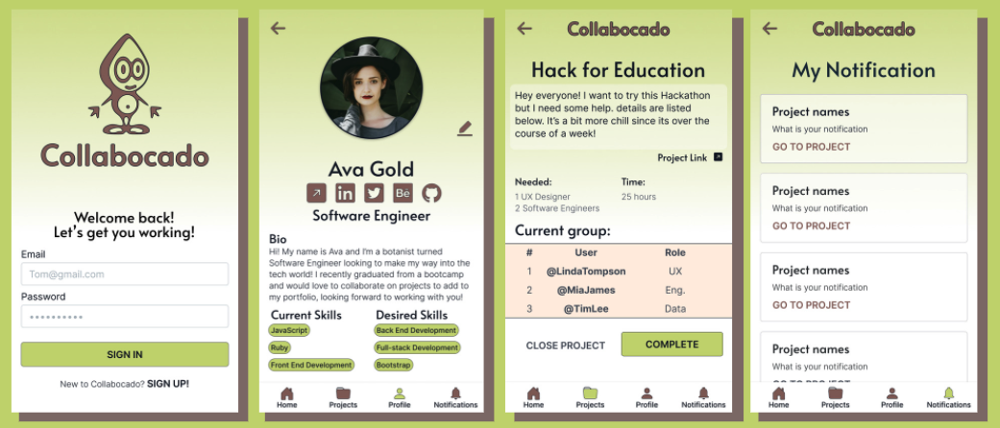
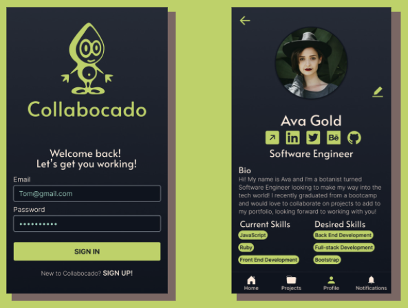

GA-Hackathon

<strong>Collabocado</strong>

<strong>Screenshots</strong>

<strong>Technologies Used</strong>

- MonogDB
- MongooseJS
- ExpressJS
- JSON Web Token Authentication
- ReactJS
- JavaScript
- Heroku
- NodeJS
- RESTful routing

<strong>Future Enhancements</strong>

- Polish Responsive design for desktop and all mobile use
- Implement Google OAuth 2.0 and Github OAuth
- Implement Dark Mode

<strong>Heroku link</strong>

- [Open Website! (Heroku)](https://collabocado.herokuapp.com/)

  <iframe loading="lazy" style="position: absolute; width: 100%; height: 100%; top: 0; left: 0; border: none; padding: 0;margin: 0;"
    src="https:&#x2F;&#x2F;www.canva.com&#x2F;design&#x2F;DAEnjvrF-fQ&#x2F;view?embed">
  </iframe>

<a href="https:&#x2F;&#x2F;www.canva.com&#x2F;design&#x2F;DAEnjvrF-fQ&#x2F;view?utm_content=DAEnjvrF-fQ&amp;utm_campaign=designshare&amp;utm_medium=embeds&amp;utm_source=link" target="_blank" rel="noopener">New and Junior Tech Professionals Comparative Analysis Link Overview Networking Creating Projects Creating a website Improve skills Cross-Functional Experience Time commitment WeAreFLIK https:&#x2F;&#x2F;weareflik.com&#x2F; New Female Tech professionals can sign up and</a> by michelleusdenski

